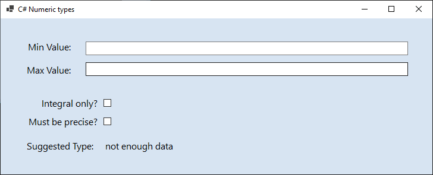

# Numeric Type Suggester

A Windows Forms desktop application that recommends the most appropriate .NET numeric data type based on value range and precision requirements.

## 📌 Project Purpose

This application solves a common developer problem: **selecting the optimal numeric type** for a given domain.

Instead of guessing between `byte`, `short`, `int`, `long`, `float`, `double`, or `decimal`, users can:
- Specify minimum and maximum values
- Define precision requirements
- Receive intelligent type recommendation

This is valuable for:
- **Performance Optimization** - Use smaller types to reduce memory footprint
- **Domain Modeling** - Choose types that exactly fit business requirements
- **Learning** - Understanding numeric types and their ranges

## 🎯 Features

### Core Functionality
✅ **Value Range Input** - Min and max value fields with validation  
✅ **Type Filtering**:
   - Integral-only checkbox (excludes floating-point types)
   - Precision checkbox (for decimal vs. float/double precision)
✅ **Intelligent Recommendation** - Suggests the most efficient type  
✅ **Input Validation** - Ensures minValue < maxValue and valid numbers  
✅ **Real-time Feedback** - Immediate type suggestion as user adjusts inputs

### Numeric Types Covered
| Type | Range | Precision | Integral |
|------|-------|-----------|----------|
| `byte` | 0 to 255 | N/A | ✓ |
| `sbyte` | -128 to 127 | N/A | ✓ |
| `short` | -32,768 to 32,767 | N/A | ✓ |
| `ushort` | 0 to 65,535 | N/A | ✓ |
| `int` | -2.1B to 2.1B | N/A | ✓ |
| `uint` | 0 to 4.2B | N/A | ✓ |
| `long` | -9.2E18 to 9.2E18 | N/A | ✓ |
| `ulong` | 0 to 1.8E19 | N/A | ✓ |
| `float` | ±3.4E38 | ~6-7 digits | ✗ |
| `double` | ±1.7E308 | ~15-17 digits | ✗ |
| `decimal` | ±7.9E28 | 28-29 digits | ✗ |

## 💻 User Interface

### Input Controls
- **Min Value:** Numeric input field
- **Max Value:** Numeric input field
- **Integral only?:** Checkbox to filter to integral types
- **Must be precise?:** Checkbox (enabled only when decimal types are available)

### Output
- **Suggested Type:** Label displaying the recommended .NET type
- **Safe Checks:** Validation messages preventing invalid input

### Visual State


## 🔧 Technical Implementation

### Technology Stack
- **Framework:** Windows Forms (.NET 8.0)
- **Language:** C# 11
- **UI Paradigm:** Event-driven GUI

### Key Design Aspects
1. **Algorithm** - Efficient type selection based on range and constraints
2. **Validation** - Input sanitization and constraint checking
3. **User Experience** - Responsive feedback and clear labeling
4. **Maintainability** - Type selection logic centralized and extensible

## 📋 Usage Scenario

**Scenario:** A developer needs to store temperature readings from -40°C to 50°C

1. Enter Min Value: `-40`
2. Enter Max Value: `50`
3. Check "Integral only?" (no decimals needed)
4. **App suggests:** `byte` (range: 0-255, but consider `sbyte` for signed)

This recommends using a `sbyte` instead of `int`, reducing memory usage by 75%.

## 🏗️ Project Structure

```
NumericTypesSuggestor/
├── MainForm.cs              # Main form logic and event handlers
├── MainForm.Designer.cs     # UI component definitions (auto-generated)
├── MainForm.resx            # UI resources
├── NumericTypeSuggester.cs  # Type suggestion algorithm
├── Program.cs               # Application entry point
├── README.md                # This file
└── imgs/                    # Screenshots and assets
```

## 🔨 Building & Running

```bash
# Build the project
dotnet build

# Run the application
dotnet run
```

## 🎓 Learning Outcomes

This project demonstrates:
- **Windows Forms Development** - Building desktop GUI applications
- **C# Type System** - Understanding numeric types and their characteristics
- **Input Validation** - Proper error handling and user feedback
- **Algorithm Design** - Efficient type selection logic
- **Event-Driven Programming** - Responding to user interactions

## 💡 Educational Value

**For Developers:**
- Learn about .NET numeric types in depth
- Understand memory efficiency implications
- Practice Windows Forms UI development

**For Code Reviewers:**
- Clean separation of concerns
- Robust input validation
- User-friendly error messaging

---

**Target Framework:** .NET 8.0-windows  
**Language Version:** C# 11+  
**UI Framework:** Windows Forms

